# Sim-to-Real Transfer of RL Policies on MuJoCo Hopper

PPO agents trained on a source MuJoCo Hopper environment with a
mass-shifted torso, then transferred to a target environment with the
original physics. Compares (a) state-based MLP vs. vision-based CNN
policies, (b) grid vs. Optuna hyperparameter search, and (c) the impact
of Uniform Domain Randomization (UDR) over link masses.

## Table of Contents

1. [Overview](#overview)
2. [Installation](#installation)
3. [Quickstart](#quickstart)
4. [Pipeline](#pipeline)
5. [Hyperparameter Tuning](#hyperparameter-tuning)
6. [Domain Randomization](#domain-randomization)
7. [Vision-Based RL](#vision-based-rl)
8. [Results](#results)
9. [Disclaimers and Attribution](#disclaimers-and-attribution)

## Overview

The source environment has a torso 1 kg lighter than the target. A PPO
policy that does well on source falls hard on target without
randomization. Domain randomization over the link masses forces the
policy to generalise across physics distributions, recovering most of
the reward. The vision-based path validates the same behaviour from
pixels instead of state.

## Installation

Tested on Linux with Python 3.7 (Windows is not supported by recent
`mujoco-py`).

1. Install MuJoCo and `mujoco-py` per the
   [openai/mujoco-py](https://github.com/openai/mujoco-py) instructions.
2. Install Python dependencies:

```bash
pip install -r requirements.txt
```

## Quickstart

```bash
# 1. Grid-search train: writes per-config checkpoints to ./models
python train.py

# 2. Optuna train: writes the per-trial best to ./models
python tuning.py

# 3. Evaluate a saved policy on source and target
python test.py

# 4. Rank DR distributions by held-out reward and plot
python analyze.py
```

Each driver loads one JSON config; pick which one by editing
`configues_dir` and `conf_name` at the top of the driver. Available
configs:

```
configues/
  mlp/grid/{single, domain_randomization, domain_and_parameters}.json
  mlp/optuna/{parameters_tuning, domain_and_parameters}.json
  cnn/grid/{single, domain_randomization, domain_and_parameters}.json
  cnn/optuna/{parameters_tuning, domain_and_parameters}.json
```

## Pipeline

```
configue.json
  -> utils.load_configue + create_params  (grid expansion or Optuna sampler)
  -> create_env   : CustomHopper + PixelObservation + Gray + Resize + Stack
  -> create_model : PPO ( MlpPolicy | CnnPolicy + custom CNN extractor )
  -> model.learn  -> checkpoints + TensorBoard
  -> test.py      : evaluate_policy on source AND target
  -> analyze.py   : rank UDR distributions by held-out reward
```

## Hyperparameter Tuning

Two strategies, same training loop.

### Grid search

`train.py` expands a list of values per hyperparameter into a Cartesian
product. The five sweep dimensions are learning rate, gamma, clip
range, entropy coefficient, and number of steps per update.

<p align="center">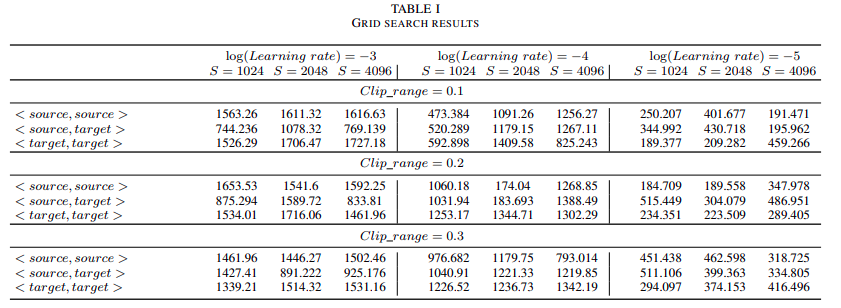</p>
<p align="center"><em>Grid-search rewards across learning rate, steps per update, and clip range.</em></p>

<p align="center">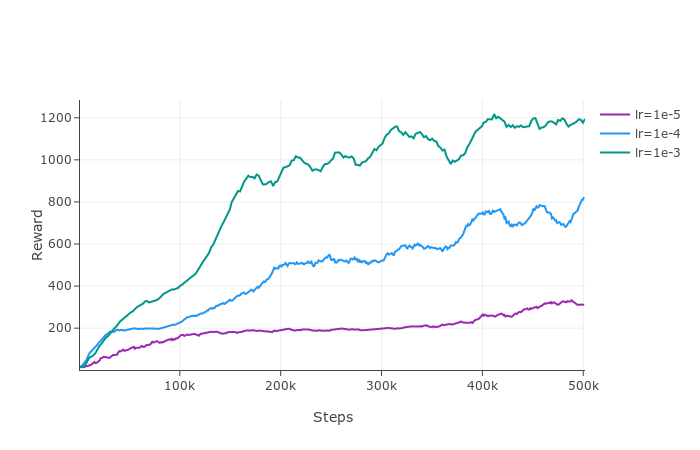</p>
<p align="center"><em>Reward progression for different learning rates. 4e-4 is the sweet spot.</em></p>

<p align="center">
  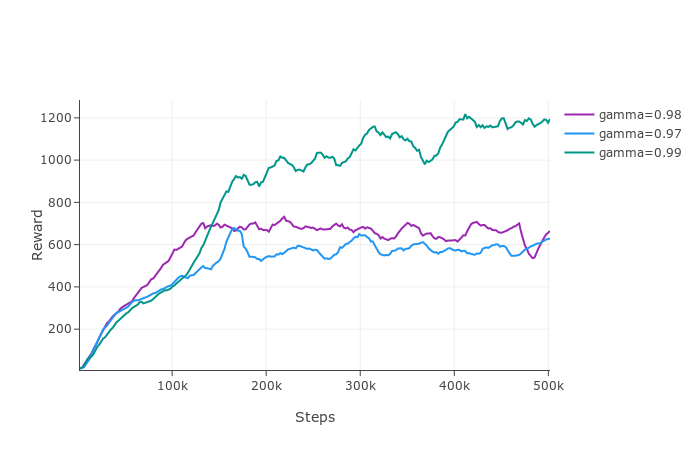
  &nbsp;&nbsp;
  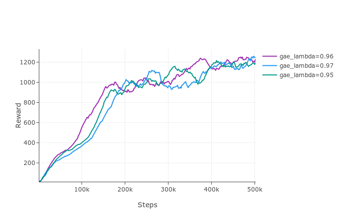
</p>
<p align="center"><em>Effect of gamma (left) and GAE lambda (right) on the source reward.</em></p>

<p align="center">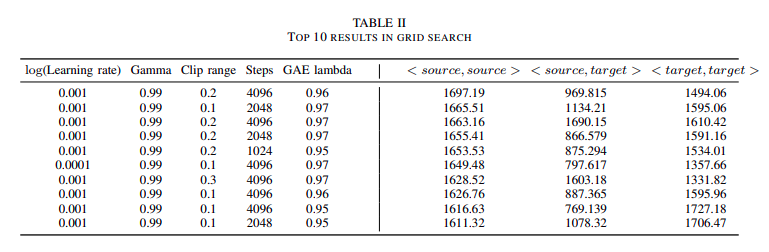</p>
<p align="center"><em>Top-10 grid configurations ranked by source reward.</em></p>

### Optuna

`tuning.py` lets the TPE sampler pick over the same space with a
configurable trial budget. With 100 trials, Optuna lifts the source
reward from the grid's ~1700 to ~1790.

<p align="center">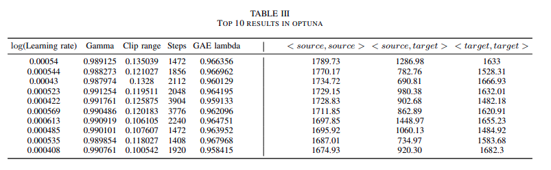</p>
<p align="center"><em>Top-10 Optuna trials.</em></p>

## Domain Randomization

`CustomHopper.set_distributions(distributions)` swaps the masses at
every `reset()` from a truncated normal centred on the original value.
The sweep parameter is the `(low, high)` range.

```python
def sample_parameters(self):
    masses = []
    for orig, (low, high) in zip(self.original_masses, self.distributions):
        masses.append(truncnorm.rvs(low, high) * orig)
    return np.array(masses)
```

Applied to the Optuna-best policy, the target reward jumps from 1286
to 1686. Wider intervals help target performance but hurt source.

<p align="center">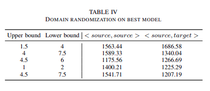</p>
<p align="center"><em>Best Optuna policy with vs. without UDR.</em></p>

<p align="center">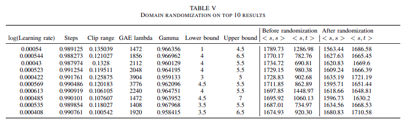</p>
<p align="center"><em>UDR applied to the top-10 Optuna policies. Target reward improves uniformly.</em></p>

## Vision-Based RL

Rendered scene to RGB, gray-scaled, resized, stacked, then fed to a CNN
feature extractor before PPO's actor-critic heads.

<p align="center">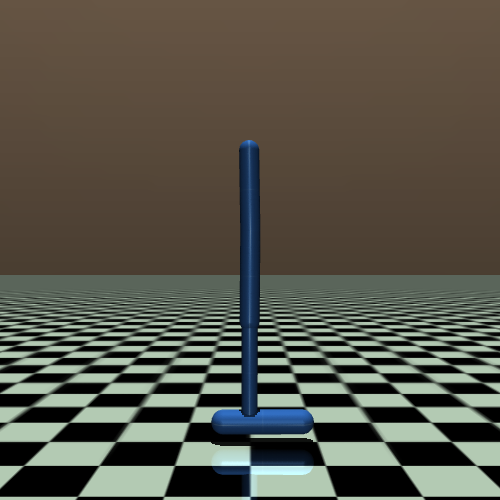</p>
<p align="center"><em>Raw Hopper RGB observation (500 x 500 x 3).</em></p>

<p align="center">
  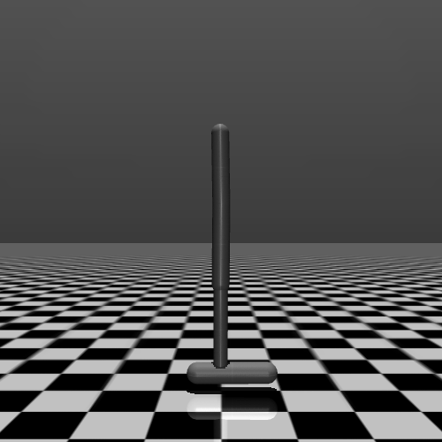
  &nbsp;&nbsp;
  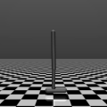
</p>
<p align="center"><em>Grayscale (left) and resized to 120 x 120 (right). Both shrink the input by ~10x with no loss in trainability.</em></p>

`models.py` defines six feature extractors built on
`stable_baselines3.common.torch_layers.BaseFeaturesExtractor`:
`CNNBaseExtractor`, `CNNSimple`, `CNNMobileNet`, `CNNLstm`,
`CNNInreasedFilters` (wide), `CNNDecreasedFilters` (narrow). All plug
into PPO via `CnnPolicy` through `utils.custom_extractor(...)`.

<p align="center">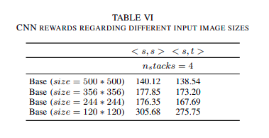</p>
<p align="center"><em>Image size sweep. 120 x 120 wins; bigger inputs train slower without a reward gain.</em></p>

<p align="center">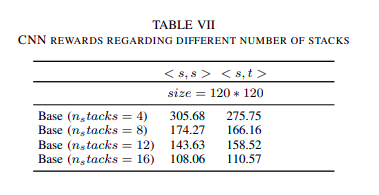</p>
<p align="center"><em>Frame stack sweep. 4 frames is enough to capture velocity from pixels.</em></p>

A supervised feature path (threshold-based segmentation followed by a
small MLP) was tried as a baseline against the learned CNN extractor.

<p align="center">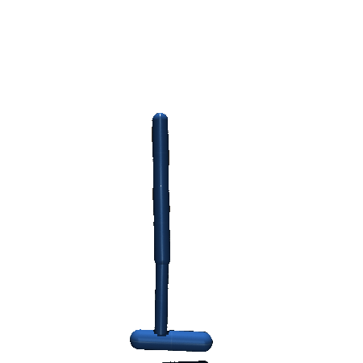</p>
<p align="center"><em>Supervised feature extraction via colour thresholds.</em></p>

<p align="center">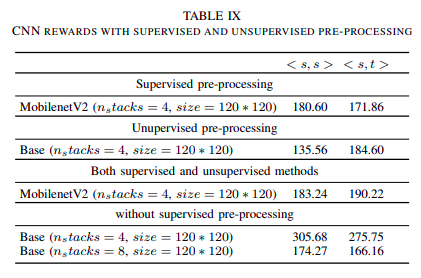</p>
<p align="center"><em>Learned CNN extractors outperform the supervised baseline on target reward.</em></p>

## Results

Headline numbers across all methods, with and without UDR:

<p align="center">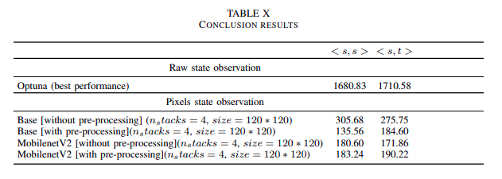</p>
<p align="center"><em>Final comparison. MLP + Optuna + UDR is the best target-reward configuration overall.</em></p>

- **State-based, no DR:** source ~1700, target 1286.
- **State-based, Optuna + UDR:** source ~1790, target 1686.
- **Vision-based, CNN + UDR:** competitive with state-based on target
  when frame stack = 4 and input is 120 x 120.

## Disclaimers and Attribution

All code in this repository (envs, wrappers, model definitions,
training drivers, evaluation, analysis) is original work for the
course project. The dependencies are upstream as is:

- [`stable-baselines3`](https://github.com/DLR-RM/stable-baselines3)
  provides PPO, `ActorCriticPolicy`, `BaseFeaturesExtractor`,
  `evaluate_policy`.
- [`gym`](https://github.com/openai/gym) (0.21) provides the
  `ObservationWrapper` base and the Hopper XML.
- [`mujoco-py`](https://github.com/openai/mujoco-py) drives the physics
  simulator.
- [`optuna`](https://github.com/optuna/optuna) drives the search in
  `tuning.py`.

No upstream policy code, no fork. The MuJoCo Hopper task is the
standard one from the Gym MuJoCo suite.
